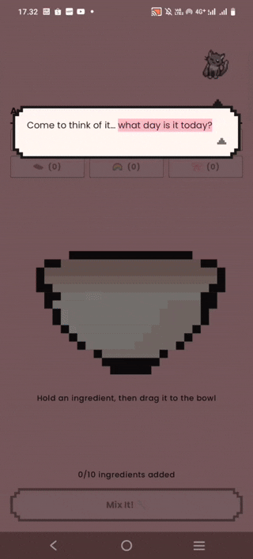
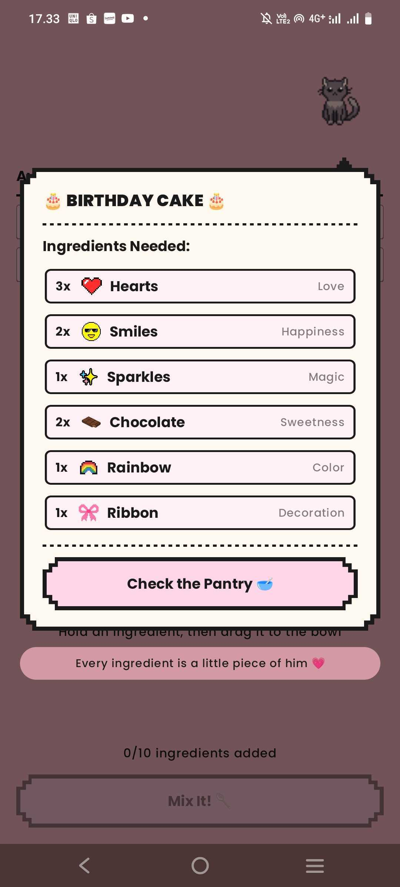
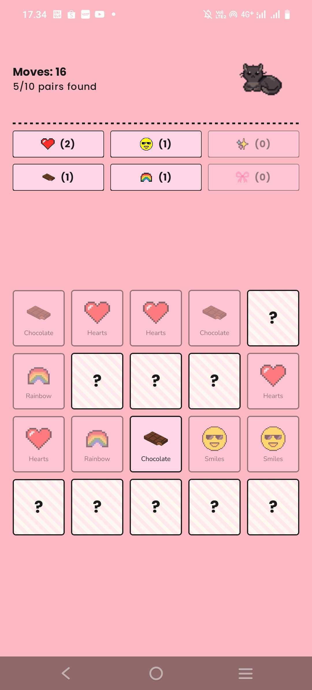
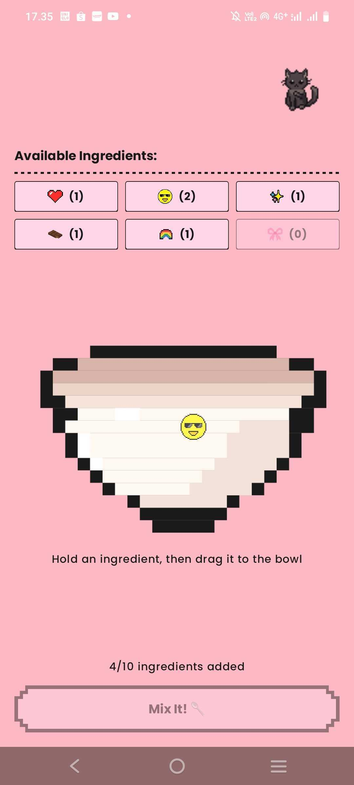
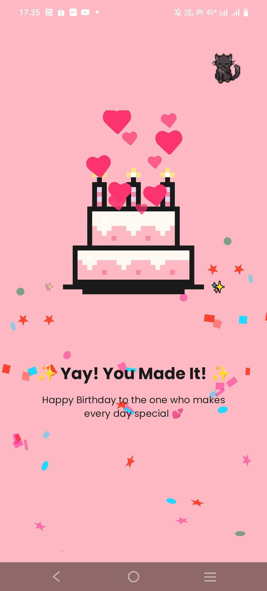
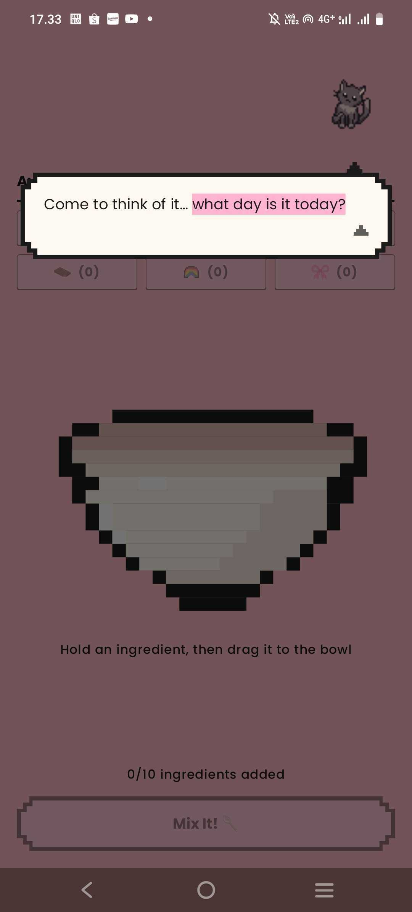
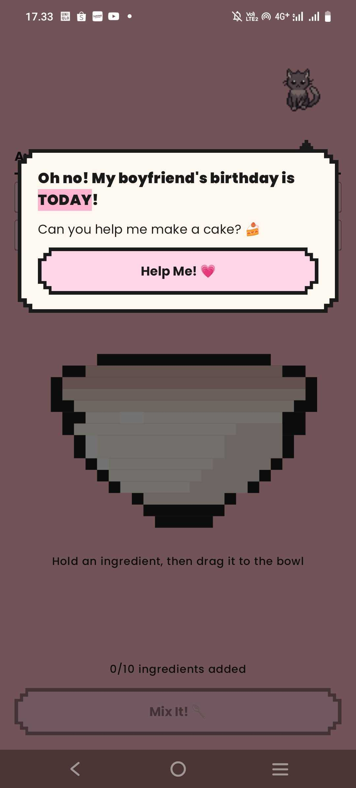
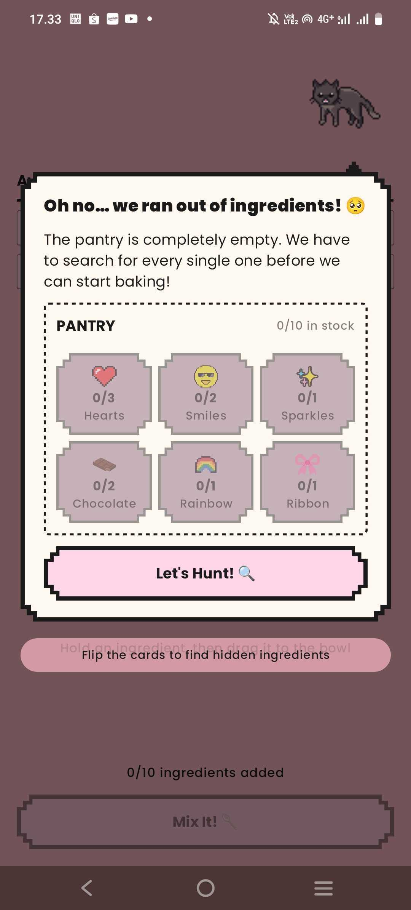
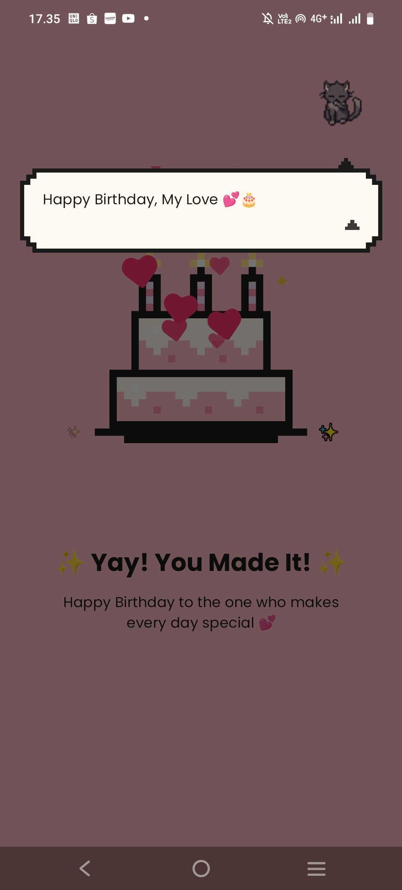

# Birthday Baker

An interactive pixel-art birthday card, built as a three-screen Android game in Jetpack Compose —
memory matching, drag-and-drop mixing, and a dialogue system where the entire script is plain data.

<p align="center">
  
</p>

---

## What it is

A birthday card you play instead of read. A cat wakes up, tells you it's someone's birthday, shows
you the recipe, then discovers the pantry is empty and sends you off to find the ingredients in a
memory-matching game. Drag what you found into the mixing bowl, hit **Mix It**, and you get a cake,
confetti, and a closing message.

Three screens, one character, about two minutes end to end. No network, no database, no login —
everything lives in memory, deliberately.

| The recipe | The hunt | The mixing | The cake |
|:---:|:---:|:---:|:---:|
|  |  |  |  |
| Dialog as data — the recipe card is a `DialogStep`, not a screen | 20 cards, 10 pairs, tap a third card mid-flip and it resolves | Drag a chip to the bowl; `Mix It` unlocks at 10/10 | Lottie confetti and hearts over the cake |

<details>
<summary><b>More screenshots — the full journey</b></summary>

<br>

| | |
|:---:|:---:|
|  |  |
| **1 · The cat wakes up** and works out what day it is | **2 · The ask** — the only dialog step with a button on it |
|  |  |
| **3 · The empty pantry** — same mixing screen as above, different state | **4 · The closing line**, over the finished cake |

</details>

---

## What's interesting in here

Four things I'd point at if you only have a minute.

**The entire dialogue script is data, not code.** Every line lives in `DialogCatalog` as a
`DialogStep` value, and there is exactly one renderer. Adding a line to the script is a one-line
edit with no UI change.

The sharp detail: `DialogStep` deliberately carries no lambdas. It's a `data class` feeding into
`AnimatedContent`, so a lambda field would make every step compare unequal to itself and restart
the transition on every recomposition — a permanently flickering dialog whose cause sits nowhere
near the animation code. Behaviour lives in one `when` in the ViewModel instead.

**State is derived wherever it can be.** `MiniHuntUiState` stores two fields and derives seven;
`GameUiState` stores five and derives seven. The example worth reading is `isMismatched`: stored,
it would be set by a match check and cleared by a coroutine a second later, and a cancelled
coroutine would leave the flag stuck on and the board dead. Derived from the cards, that bug cannot
be represented.

**The memory game handles the impatient player.** Flip two cards, miss, and tap a third before the
flip-back timer fires — most implementations swallow that tap. This one cancels the timer, settles
the old pair, and reveals the new card in a single atomic state update. The delayed job also
re-checks the cards by id when it wakes, so a restart turns it into a no-op instead of flipping
down cards on a new board.

**All the game logic runs in JVM unit tests, with no emulator.** Nothing in either ViewModel
touches a `Context` — `DialogText` holds a string *resource id* rather than a resolved string, so
the catalog needs no Android at all.

There's a full written walkthrough of all of this in **[`docs/learning/`](docs/learning/)** — ten
modules covering architecture, state, both mini-games, layout and art, and testing.

---

## Architecture

MVVM with unidirectional data flow. State flows down, events flow up, nothing flows sideways.

```
┌──────────────────────────────────────────────────────────────┐
│  UI            Composables. Draw state, emit events.         │
│                Own no game logic.                            │
│                MainActivity, ui/screen/, ui/components/      │
└──────────────────────────────────────────────────────────────┘
                  ↑ state flows up      events flow down ↓
┌──────────────────────────────────────────────────────────────┐
│  STATE + LOGIC  ViewModels hold the truth and the rules.     │
│                 UiState classes shape it for drawing.        │
│                 GameViewModel, MiniHuntViewModel             │
│                 GameUiState, MiniHuntUiState                 │
└──────────────────────────────────────────────────────────────┘
                                ↑ reads
┌──────────────────────────────────────────────────────────────┐
│  DATA          Plain immutable values. No Compose, no        │
│                Android Context, no behaviour.                │
│                GameData, DialogCatalog, model/               │
└──────────────────────────────────────────────────────────────┘
```

There are two ViewModels, not one. `GameViewModel` owns the whole game — current screen, inventory,
bowl contents, active dialog, cat expression. `MiniHuntViewModel` owns only the memory board and its
20 cards, and it doesn't know the rest of the game exists. They meet at exactly one point: the hunt
finishes and hands its result upward.

```
app/src/main/java/com/cinthya/birthdaycake/
├── data/            GameData, DialogCatalog — the recipe and the script
├── model/           Ingredients, MemoryCard, GameScreen, dialog/
├── ui/
│   ├── screen/      MixingPage, MiniHuntPage, FinalPage
│   ├── components/  PixelButton, FlipCard, GamePageScaffold, dialog/
│   ├── state/       GameUiState, MiniHuntUiState
│   ├── theme/       GameColors, Theme, Type
│   └── viewmodel/   GameViewModel, MiniHuntViewModel
└── MainActivity.kt
```

---

## Built with

Kotlin 2.2.10 · Jetpack Compose (BOM 2026.02.01) · Material 3 · ViewModel + StateFlow ·
[Coil](https://coil-kt.github.io/coil/) 3.3.0 for the animated cat GIFs ·
[Lottie](https://github.com/airbnb/lottie-android) 6.7.1 for confetti and sparkles

`minSdk 28` (Android 9) · `targetSdk 36` · AGP 9.2.1 · JVM target 11

No dependency injection framework, no navigation library, no persistence layer — see below.

---

## Running it

Open in Android Studio and hit run, or from the command line:

```bash
./gradlew installDebug     # build and install on a connected device or emulator
./gradlew test             # run the JVM unit tests
```

No API keys, no `local.properties` setup beyond your SDK path, no backend to point at.

---

## Testing

Three JUnit test classes, no emulator and no Robolectric:

| Test | Covers |
|---|---|
| `DialogSequenceTest` | The dialog cursor — advancing, bounds, completion |
| `GameUiStateTest` | Derived properties, including the `isMixReady` trap |
| `GameViewModelTest` | The game flow end to end, with a seeded `Random` for a deterministic deck |

`GameViewModel` and `MiniHuntViewModel` take their dependencies as defaulted constructor parameters,
which gives `viewModel()` a no-arg constructor *and* lets a test inject a seeded `Random`. That's
also why there's no Hilt.

---

## Deliberate non-choices

Each of these is an absence with a reason, and a line at which it would become the wrong call.

| Not used | Because |
|---|---|
| Navigation Compose | Three linear screens, no back stack (back is actively blocked), no deep links, no arguments to serialise. Adding a fourth screen or a real back stack would change this. |
| Hilt / Koin | Two defaulted constructor parameters do the whole job. A second injected dependency would tip it. |
| Room / a repository layer | A two-minute session with nothing worth persisting. |
| Material You / dark theme | The pink page and cream panel *are* the artwork; a wallpaper-derived palette would repaint them per device. |

---

## Known limitations

Named here rather than left to be found:

- **`MiniHuntViewModel` has no unit tests.** It's the most intricate logic in the project — early
  resolve, cancellable jobs, the wake-up re-check — and it's harder to test than `GameViewModel`
  because it schedules coroutines, so it needs `kotlinx-coroutines-test` and `Dispatchers.setMain`.
  Top of the backlog.
- **No process-death survival.** Rotating or backgrounding for long enough restarts the game. The
  state design accommodates `SavedStateHandle`; it just isn't wired up.
- **No end-to-end accessibility pass.** There are deliberate touches — face-down cards announce
  "hidden card" rather than their symbol so TalkBack doesn't give the board away, disabled buttons
  are marked disabled, the decorative cat is `contentDescription = null` — but drag-and-drop has no
  keyboard or switch-access alternative and nothing has been tested with TalkBack end to end.
- **Two animations kept in sync by hand.** The dialog body's `AnimatedContent` and the footnote's
  `Crossfade` share timing constants but are separate animations.

---

## Credits

The art in this project is not mine, and it's a real part of why the app looks the way it does.

- **Cat animations** — [64x64 FREE Pixel Cats animated NPC](https://last-tick.itch.io/animated-pixel-cats-64x64)
  by [Last tick](https://last-tick.itch.io). Free for personal and commercial use; reselling or
  redistributing the pack itself is prohibited. If you want these cats, get them from Last tick —
  and consider paying their name-your-price.
- **Pixel art and UI elements** (ingredients, cards, frames, buttons, the cake) — free assets from
  [Canva](https://www.canva.com), used under the
  [Canva Content License Agreement](https://www.canva.com/policies/content-license-agreement/).
- **Lottie animations** from [LottieFiles](https://lottiefiles.com), free to use with attribution:
  - `confetti.lottie` — *Confetti Effects Lottie Animation* by SM Rony
  - `heart.lottie` — *Hearts Feedback* by Andrew McKay
  - `sparkle.lottie` — *Stars Game Square* by Kill Lu

---

## Licence

**The code** is free to use, copy, change, and learn from for any noncommercial purpose, as long as
you credit me and link back to this repository — see [LICENSE](LICENSE). You may not sell it,
distribute it for a fee, or use it to promote a commercial product.

**The assets are not mine to license.** The cat GIFs, the Canva artwork, and the Lottie files stay
under their original terms (see Credits). They're in this repository so the app builds and runs, not
as a pack for redistribution or resale.

If you're learning from this and something here helped, that's exactly what it's for.
